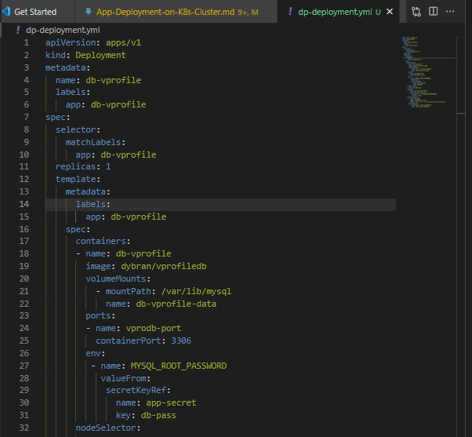
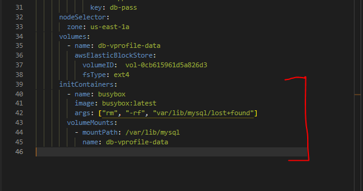

## WEB APPLICATION DEPLOYMENT ON KUBERNETES CLUSTER AND MONITORING WITH LENS

__SCENARIO:__

In the scope, my objective is to take the web application that I have already containerized and tested as demonstrated in the [__Containerizing a Java stack App Project__](https://github.com/dybran/Containerizing-a-JAVA-Stack-Application/blob/main/Containerizing-an-application-using-docker.md) and proceed to deploy it onto a __Kubernetes cluster__ for production.

__REQUIREMENT:__

- __High availability:__ To ensure that containers remain operational without downtime, and it also extends to maintaining the availability of compute nodes.
- __Fault tolerance:__ In the event that containers encounter issues and become unresponsive, they should automatically undergo a healing process.
- __Easily scalable:__  The process of scaling containers and the associated compute resources they utilize should be effortless.
- The Container should possess compatibility across various platforms attributes, ensuring portability, adaptability, and agility. It must have the capability to function seamlessly across cloud infrastructure and virtual machines, while also accommodating various environments including Development, Quality Assurance, Testing, and Production.

__TASK:__
- Setup kubernetes cluster using kops
- containerized application -  [__here__](https://github.com/dybran/Containerizing-a-JAVA-Stack-Application).
- Create EBS volume for DB Pod - persistent data.
- LABEL nodes with zone names.
- Write kubernetes definition files to create the objects on kubernets cluster.
  - Deployment
  - service
  - secret
  - volume
- Setup Lens kubernetes IDE for monitoring.

__Setup Kubernetes cluster with kops__

Click [__here__](https://github.com/dybran/Kubernetes-Cluster-Setup-with-Kops/blob/main/Kubernetes-setup-with-kops.md) to setup kubernetes cluster with kops.

Create configurations for the cluster

`$ kops create cluster --name=mydevopsproject.top --state=s3://project-kops-state --zones=us-east-1a,us-east-1b --node-count=2 --node-size=t3.small --master-size=t3.medium --dns-zone=mydevopsproject.top --node-volume-size=8 --master-volume-size=8`


Create the cluster

`$ kops update cluster --state=s3://project-kops-state --name=mydevopsproject.top --yes --admin`


Wait for 15mins then validate

`$ kops validate cluster --state=s3://project-kops-state`


__Create EBS volume__

Create EBS volume to store the data which gets created in __/var/lib/mysql__ volume.

`$ aws ec2 create-volume --availability-zone=us-east-1a --size=3 --volume-type=gp2`


Tag the EBS volume with the name of the kubernetes cluster

`$ aws ec2 create-tags --resources vol-0cb615961d5a826d3 --tags Key=KubernetesCluster,Value=mydevopsproject.top`

Verify

`$ aws ec2 describe-volumes --volume-ids vol-0cb615961d5a826d3 --query 'Volumes[0].Tags'`


Ensure that you carefully record both the __volume ID__ and __zone__ of the EBS volume. The DB pod is created within a node situated in the same availability zone where the EBS volume was created. This can be achieved by utilizing the __"node selector"__ within the definition file.

To label the nodes according to their availability zones- __us-east-1a__ and __us-east-1b__

`$ kubectl get nodes`

`$ kubectl describe nodes <node-IP> | grep us-east-1`

`$ kubectl label node <node-IP> zone=us-east-1a`


Verify

`$ kubectl get nodes --show-labels`


I plan to utilize images I have previously uploaded to DockerHub in [__Containerizing a Java stack App Project__](https://github.com/dybran/Containerizing-a-JAVA-Stack-Application/blob/main/Containerizing-an-application-using-docker.md).

Specifically, I will work with the images names __dybran/vprofileapp__ - for app and __dybran/vprofiledb__ - for database. Instead of directly using __dybran/vprofileweb__, I will set up a Load Balancer as part of the process to replace it.

From [__Containerizing a Java stack App Project__](https://github.com/dybran/Containerizing-a-JAVA-Stack-Application/blob/main/Containerizing-an-application-using-docker.md), we need to take note of the passwords for the __Mysql database__ and the __Rabbit MQ__ which can be found [here](https://github.com/dybran/Containerizing-a-JAVA-Stack-Application/blob/main/project/src/main/resources/application.properties).

We will encode the passwords and give the encoded value in the secret definition file we will write.

To encode the password for Mysql and Rabbit MQ

`$ echo -n "<db-password>" | base64`

`$ echo -n "<rmq-password>" | base64`


__Write the "secret" definition__

```
apiVersion: v1
kind: Secret
metadata:
  name: app-secret
type: Opaque
data:
  db-pass: c2E0bGEyeGE=
  rmq-pass: Z3Vlc3Q=
```


Create the secret definition file

`$ kubectl apply -f secret.yml`

`$ kubectl get secret`

`$ kubectl describe secret`


When we run the __"kubectl describe"__ command, the values of the encoded secrets are shown in bytes.

__Write the "DB Deployment" definition__

```
apiVersion: apps/v1
kind: Deployment
metadata:
  name: db-vprofile
  labels:
    app: db-vprofile
spec:
  selector:
    matchLabels:
      app: db-vprofile
  replicas: 1
  template:
    metadata:
      labels:
        app: db-vprofile
    spec:
      containers:
      - name: db-vprofile
        image: dybran/vprofiledb
        volumeMounts:
          - mountPath: /var/lib/mysql
            name: db-vprofile-data
        ports:
        - name: vprodb-port
          containerPort: 3306
        env:
         - name: MYSQL_ROOT_PASSWORD
           valueFrom:
            secretKeyRef:
              name: app-secret
              key: db-pass
      nodeSelector:
        zone: us-east-1a
      volumes:
        - name: db-vprofile-data
          awsElasticBlockStore:
            volumeID:  vol-0cb615961d5a826d3
            fsType: ext4
      initContainers:
        - name: busybox
          image: busybox:latest
          args: ["rm", "-rf", "var/lib/mysql/lost+found"]
          volumeMounts:
            - name: db-vprofile-data
              mountPath: /var/lib/mysql
```



The __"initContainers"__ section above runs a container in the pod that aims at removing the __"lost+found"__ directory created when the EBS volume is formated using __ext4__. If the __lost+found__ directory is not removed there will be errors stating that the volume is not empty.