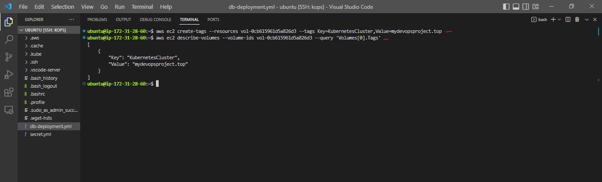

## WEB APPLICATION DEPLOYMENT ON KUBERNETES CLUSTER AND MONITORING WITH LENS


The important concepts and requirements in the context of deploying and managing applications using Kubernete include:

__High Availability (HA)__: This refers to the ability of a system to continue functioning and providing services even in the presence of failures. In Kubernetes, high availability is achieved by running multiple instances of your containers (replicas) across different nodes in the cluster. If one node or container fails, the workload can be automatically moved to a healthy node, minimizing downtime.

__Fault Tolerance__: Fault tolerance is closely related to high availability. In Kubernetes, if a container becomes unresponsive or fails, the system can automatically detect this and take actions to recover it. This might involve restarting the container or rescheduling it onto a healthy node.

__Scalability__: Kubernetes allows you to easily scale your applications by adjusting the number of container replicas running in your cluster. This can be done manually or automatically based on metrics like CPU utilization or incoming traffic. Kubernetes also supports horizontal scaling, which means you can add or remove instances of your application without modifying the underlying infrastructure.

__Compatibility and Portability__: Kubernetes aims to provide a consistent environment for deploying and managing containers, regardless of the underlying infrastructure or cloud provider. This means that applications packaged as containers should work consistently across different Kubernetes clusters, cloud platforms (like AWS, Azure, Google Cloud), and on-premises environments.

__Adaptability and Agility__: Kubernetes allows you to define your application's desired state through configuration files, which are usually written in YAML. This declarative approach makes it easy to modify and adapt your application's configuration, enabling quick adjustments to your application as requirements change. This agility is important for development, testing, and deployment workflows.

__Multi-Environment Support__: Kubernetes supports deploying applications in different environments, such as development, quality assurance (QA), testing, and production. This is achieved through the use of namespaces and different configuration files for each environment. Each environment can have its own resources, access controls, and configurations, ensuring isolation and consistency.

__SCENARIO:__

In the scope, my objective is to take the web application that I have already containerized and tested as demonstrated in the [__Containerizing a Java stack App Project__](https://github.com/dybran/Containerizing-a-JAVA-Stack-Application/blob/main/Containerizing-an-application-using-docker.md) and proceed to deploy it onto a __Kubernetes cluster__.

__TASK:__
- Setup kubernetes cluster using kops
- containerized application -  [__here__](https://github.com/dybran/Containerizing-a-JAVA-Stack-Application).
- Create EBS volume for DB Pod - persistent data.
- LABEL nodes with zone names.
- Write kubernetes definition files to create the objects on kubernets cluster.
  - Deployment
  - service
  - secret
  - volume
- Setup Lens kubernetes IDE for monitoring.

__Setup Kubernetes cluster with kops__

Click [__here__](https://github.com/dybran/Kubernetes-Cluster-Setup-with-Kops/blob/main/Kubernetes-setup-with-kops.md) to setup kubernetes cluster with kops.

Create configurations for the cluster

`$ kops create cluster --name=mydevopsproject.top --state=s3://project-kops-state --zones=us-east-1a,us-east-1b --node-count=2 --node-size=t3.small --master-size=t3.medium --dns-zone=mydevopsproject.top --node-volume-size=8 --master-volume-size=8`


Create the cluster

`$ kops update cluster --state=s3://project-kops-state --name=mydevopsproject.top --yes --admin`


Wait for 15mins then validate

`$ kops validate cluster --state=s3://project-kops-state`


__Create EBS volume__

Create EBS volume to store the data which gets created in __/var/lib/mysql__ volume.

`$ aws ec2 create-volume --availability-zone=us-east-1a --size=3 --volume-type=gp2`


Tag the EBS volume with the name of the kubernetes cluster

`$ aws ec2 create-tags --resources vol-0cb615961d5a826d3 --tags Key=KubernetesCluster,Value=mydevopsproject.top`

Verify

`$ aws ec2 describe-volumes --volume-ids vol-0cb615961d5a826d3 --query 'Volumes[0].Tags'`



Ensure that you carefully record both the __volume ID__ and __zone__ of the EBS volume. The DB pod is created within a node situated in the same availability zone where the EBS volume was created. This can be achieved by utilizing the __"node selector"__ within the definition file.

To label the nodes according to their availability zones- __us-east-1a__ and __us-east-1b__

`$ kubectl get nodes`

`$ kubectl describe nodes <node-IP> | grep us-east-1`

`$ kubectl label node <node-IP> zone=us-east-1a`


Verify

`$ kubectl get nodes --show-labels`


I plan to utilize images I have previously uploaded to DockerHub in [__Containerizing a Java stack App Project__](https://github.com/dybran/Containerizing-a-JAVA-Stack-Application/blob/main/Containerizing-an-application-using-docker.md).

Specifically, I will work with the images names __dybran/vprofileapp__ - for app and __dybran/vprofiledb__ - for database. Instead of directly using __dybran/vprofileweb__, I will set up a Load Balancer as part of the process to replace it.

From [__Containerizing a Java stack App Project__](https://github.com/dybran/Containerizing-a-JAVA-Stack-Application/blob/main/Containerizing-an-application-using-docker.md), we need to take note of the passwords for the __Mysql database__ and the __Rabbit MQ__ which can be found [here](https://github.com/dybran/Containerizing-a-JAVA-Stack-Application/blob/main/project/src/main/resources/application.properties).

We will encode the passwords and give the encoded value in the secret definition file.

To encode the password for Mysql and Rabbit MQ

`$ echo -n "<db-password>" | base64`

`$ echo -n "<rmq-password>" | base64`


__Write the "secret" definition__

```
apiVersion: v1
kind: Secret
metadata:
  name: app-secret
type: Opaque
data:
  db-pass: c2E0bGEyeGE=
  rmq-pass: Z3Vlc3Q=
```


Create the secret definition file

`$ kubectl apply -f secret.yml`

`$ kubectl get secret`

`$ kubectl describe secret`


When we run the __"kubectl describe"__ command, the values of the encoded secrets are shown in bytes.

__Write the "Deployment" and "service" Definition__

__For DB Deployment__

```
apiVersion: apps/v1
kind: Deployment
metadata:
  name: db-vprofile
  labels:
    app: db-vprofile
spec:
  selector:
    matchLabels:
      app: db-vprofile
  replicas: 1
  template:
    metadata:
      labels:
        app: db-vprofile
    spec:
      containers:
      - name: db-vprofile
        image: dybran/vprofiledb:latest
        volumeMounts:
          - mountPath: /var/lib/mysql
            name: db-vprofile-data
        ports:
        - name: vprodb-port
          containerPort: 3306
        env:
         - name: MYSQL_ROOT_PASSWORD
           valueFrom:
            secretKeyRef:
              name: app-secret
              key: db-pass
      nodeSelector:
        zone: us-east-1a
      volumes:
        - name: db-vprofile-data
          awsElasticBlockStore:
            volumeID:  vol-0cb615961d5a826d3
            fsType: ext4
      initContainers:
        - name: busybox
          image: busybox:latest
          args: ["rm", "-rf", "var/lib/mysql/lost+found"]
          volumeMounts:
            - name: db-vprofile-data
              mountPath: /var/lib/mysql
```


The __"initContainers"__ section above runs a container in the pod that aims at removing the __"lost+found"__ directory created when the EBS volume is formated using __ext4__. If the __lost+found__ directory is not removed there will be errors stating that the volume is not empty.

__For DB service__

```
apiVersion: v1
kind: Service
metadata:
  name: vprodb
spec:
  ports:
   - port: 3306
     targetPort: vprodb-port
     protocol: TCP
  selector:
    app: db-vprofile
```


__For App__

```
apiVersion: v1
kind: Service
metadata:
  name: vproapp-service
spec:
  ports:
  - port: 80
    targetPort: vproapp-port
    protocol: TCP
  selector:
    app: app-vprofile
  type: LoadBalancer
```


```
apiVersion: apps/v1
kind: Deployment
metadata:
  name: app-vprofile
  labels: 
    app: app-vprofile
spec:
  replicas: 1
  selector:
    matchLabels:
      app: app-vprofile
  template:
    metadata:
      labels:
        app: app-vprofile
    spec:
      containers:
      - name: app-vprofile
        image: dybran/vprofileapp:latest
        ports:
        - name: vproapp-port
          containerPort: 8080
      initContainers:
      - name: init-mydb
        image: busybox
        command: ['sh', '-c', 'until nslookup vprodb.$(cat /var/run/secrets/kubernetes.io/serviceaccount/namespace).svc.cluster.local; do echo waiting for mydb; sleep 2; done;']
      - name: init-memcache
        image: busybox
        command: ['sh', '-c', 'until nslookup vprocache01.$(cat /var/run/secrets/kubernetes.io/serviceaccount/namespace).svc.cluster.local; do echo waiting for mydb; sleep 2; done;']
```


In the __app__ definition file above, our intention is to ensure that the __db__ and __memcached__ deployments initiate and become operational prior to the commencement of the app deployment. To achieve this sequencing, we will once again execute init containers and issue specific commands within them. These commands are designed to verify the accessibility of __vprodb__ and __vprocache01__. Only once the __db__ and __memecache__ systems are up and running will these init containers conclude their operations, paving the way for the app container to start.

The underlying command within this process employs a loop mechanism. This loop utilizes the nslookup command to validate the DNS resolution for the hostnames `vprocache01.$(cat /var/run/secrets/kubernetes.io/serviceaccount/namespace).svc.cluster.local;` and `vprodb01.$(cat /var/run/secrets/kubernetes.io/serviceaccount/namespace).svc.cluster.local;`. 

These hostnames are derived by extracting the content from the file located at __/var/run/secrets/kubernetes.io/serviceaccount/namespace__. The content of this file indicates the specific Kubernetes namespace within which the command is being executed.


We then write the definition files for the __memechached__ and ___rabbit MQ__.

## __N/B:__
All the "__name__" in the service definition files in this setup will be based on the __application.properties__ file [here](https://github.com/dybran/Containerizing-a-JAVA-Stack-Application/blob/main/project/src/main/resources/application.properties) as seen in the above screenshot. e.g __name: vprodb__

 The __deployment__ and __service__ definition files for this set up can be found [__here__](https://github.com/dybran/App-Deployment-on-Kubernetes-Cluster/tree/main/app-deloy).

Apply

`$ kubectl apply -f .`

`$ kubectl get deploy`

`kubectl get pods`

`$kubectl get svc`


We can access the application from the browser using the loadbalancer endpoint.


__Attach a subdomain name to the load balancer__

We can attach a subdomain name to the loadbalancer endpoint through __route 53__ by creating a __CNAME__ record.


__Kubernetes Lens Monitoring dashboard setup__

Kubernetes Lens is a graphical user interface (GUI) tool designed to help developers and operators manage Kubernetes clusters more effectively. It provides a streamlined and user-friendly way to interact with and monitor your Kubernetes clusters, making it easier to visualize, troubleshoot, and manage applications and resources running on Kubernetes.

Refer to the [Kubernetes Lens official documentation](https://docs.k8slens.dev/) when setting up Lens.

Download and Install __Kubernetes Lens__ through the browser.


From the __"+"__ sign, select __"add cluster from kubeconfig"__


Add __.kube/config__


Kubernetes Lens employs Prometheus for monitoring metrics. In case Prometheus is pre-installed, the tool can readily retrieve metrics from it.

Alternatively, Kubernetes Lens offers the flexibility to set up a custom Prometheus instance if needed.


Click on __ESC__


We can now see the metrics of the cluster


Node metrics


Deployment metrics


We can check the logs 


We have deployed our application on Kubernetes, while also implementing monitoring via Kubernetes Lens.

To delete the resources/objects

`$ kubectl delete -f .`


Delete the cluster

`$ kops delete cluster --name=mydevopsproject.top --state=s3://project-kops-state --yes`

